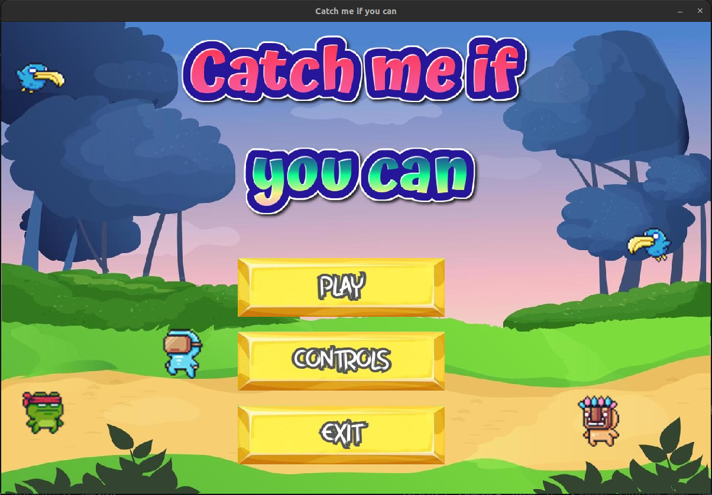

#  Catch Me If You Can 

## Descripcción 

>"Catch Me If You Can" es un juego hecho a partir de la libreria de PyGame, es del tipo "platformer". El personaje principal cambia en cada nivel. EL objetivo del Player es >recolectar todas las frutas del nivel para pasar al siguiente nivel, tratando de que no lo maten los enemigos ni las trampas.

